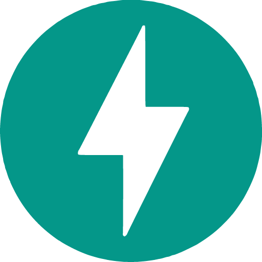

   

<h3>  
  Desenvolvendo projetos em Python 🐍, trabalhando atualmente como Analista de dados.
</h3>
   

<h3>  
  •  💻 linguagens: Python, Javascript
</h3>
  
<h3>
  •  🩹 Tecnologias/Frameworks: 
   Docker,  Flask ,  FastAPI ,  Django 
</h3>
  
<h3>  
  •  💾 Banco de dados:  Postgres,   SQL Server
</h3>
   

  
  
  

  

   

